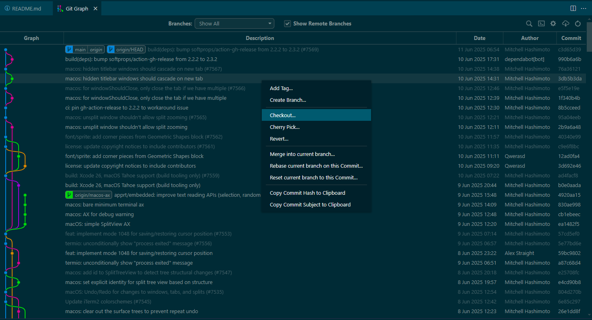

# Prompt 1.1

Make a VSCode extension like the one pictured that will visualize the Git commits of the current repo in a graph format. Make it so right clicking each row will provide a context menu of helpful Git commands.

Also, make it compatible with jujustu VCS (jj). Have a dropdown selector or radio button that will toggle between Git and JJ commands/view, and if JJ, show change IDs as well as commits. If there is a .jj folder, automatically turn on jj mode.

When making the code, avoid OOP and complicated language features. Make everything procedural, functional, linear, simple, and imperative.

# Repsonse 1.1

This sets up a basic VSCode extension that creates a simple webview showing commits from either Git or JJ depending on the repo. It uses procedural style throughout.

Next steps:

Add syntax highlighting/graph lines with SVG or canvas

Include full commit message, author, date

Improve error handling and async execution

Want me to add SVG graph visuals next?
